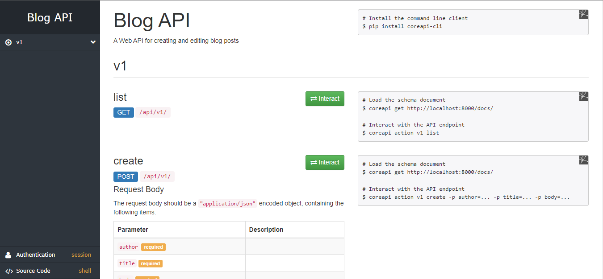
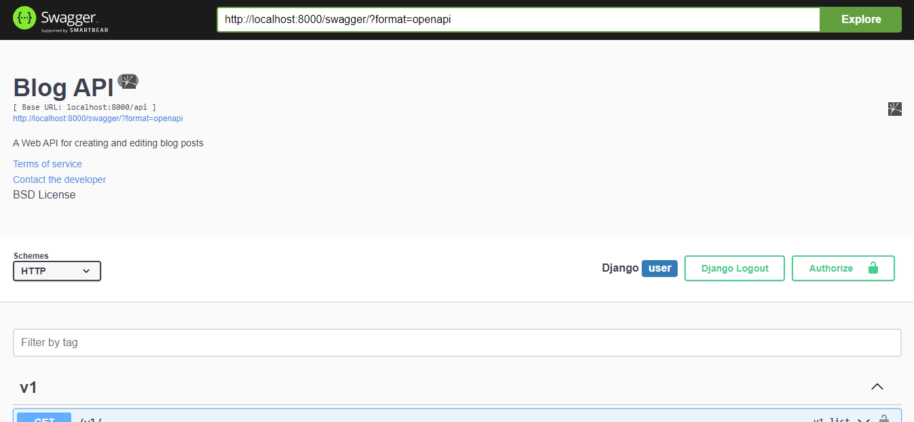
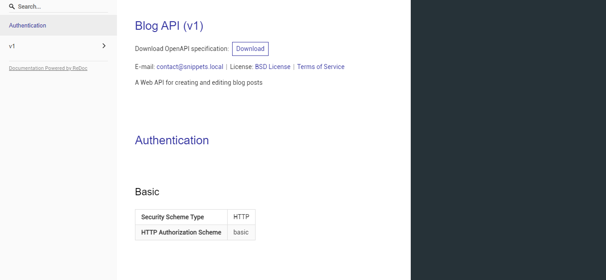

# django-blog-api

## Description
A Web API for creating and editing blog posts.
The main endpoint is in ```https://127.0.0.1:8000/api/v1```

## Usage
- Clone this repository.
- To install, use
    - ```pipenv install pipfile```
- ```py manage.py runserver```


## Documentation
- To get documentation (CoreAPI) standard:  
    ```https://127.0.0.1:8000/docs```  
      

- Swagger UI API view (Browsable):  
    ```https://127.0.0.1:8000/swagger```  
      

- OpenAPI standard:  
    ```https://127.0.0.1:8000/redoc```  
      